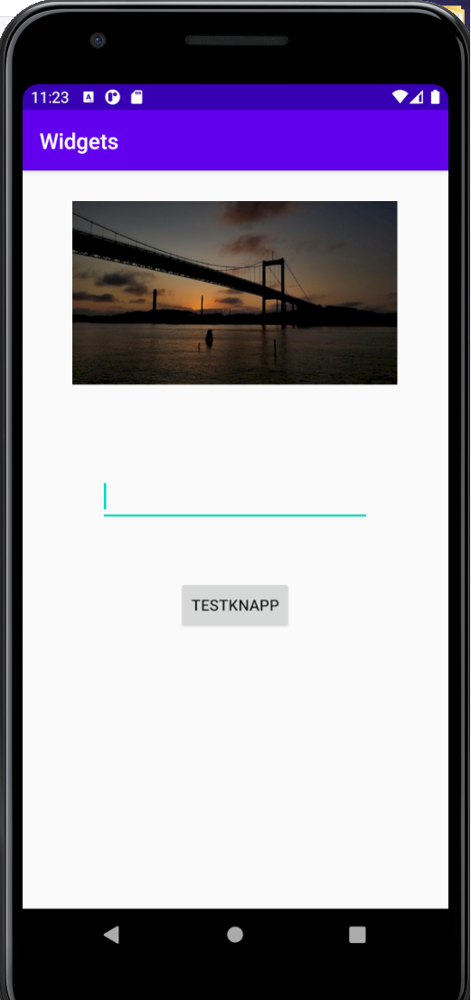

# Rapport


Först togs allt som stog i "activity_main.xml". Detta gjordes föt att byta från "constraint layout"
till "Linear layout". Det som lades till var koden nedan.

```
<LinearLayout xmlns:app="http://schemas.android.com/apk/res-auto"
        xmlns:tools="http://schemas.android.com/tools"
        xmlns:android="http://schemas.android.com/apk/res/android"
        android:layout_width="match_parent"
        android:layout_height="match_parent"
        android:orientation="vertical"
        tools:context=".MainActivity">
```

Därefter började arbetet med att lägga till de widgets som skall vara med. Den första widgeten som lades
till var ett text fält som man kan skriva i. Denna lades till med en "<EditText>" som visas nedan.

```
<EditText
        android:id="@+id/textbox"

        android:layout_width="250dp"
        android:layout_height="50dp"
        android:layout_marginBottom="50dp"
        android:layout_gravity="center_horizontal" />
```

Här får även text fältet egenskaper som bredd och höjd. Den sista raden placerar text fältet i
mitten av skärmen oavsätt storlek.

Nästa widget som lades till var en knapp. Denna knappen gör ingenting för tilfället men har blivit
tilldelat ett id så att den kan användas i framtiden. Knappen har egenskaper som gör att den skall
ta upp så mycket plats som behövs för innehållet. Detta visas nedan från koden.

```
<Button
        android:id="@+id/myNewBtn"
        android:text="testknapp"
        android:layout_gravity="center_horizontal"
        android:layout_marginBottom="50dp"
        android:layout_width="wrap_content"
        android:layout_height="wrap_content" />
```
även här har det använts gravity för att centrera knappen. det uppstår en varninbg här då android
studio inte gillar att ha med hårdkodad text. Denna hårdkodade text är texten på knappen. För att lösa
detta kan man lägga in denna string i @string XML filen och referera till den. Det har dock i8nte gjorts här.

Den tredje widgeten som lades till var en "ImageView" och den lades överst då det blev snyggare layoutmässigt.
Nedan är en bild på appen.



Även bilden är placerad i mitten av skärmen. Det finns med en layout rad på två av dessa widgets
som gör att marginalen från botten av widgeten är 50dp. Detta gör mellanrummet mellan delarna på
appen som man kan se på bilden.

```
<ImageView
        android:id="@+id/imageView3"
        android:layout_width="300dp"
        android:layout_height="wrap_content"
        android:layout_gravity="center_horizontal"
        android:layout_marginBottom="50dp"
        android:contentDescription="bild på bro"
        app:srcCompat="@drawable/bildpobro" />
```

För att använda en egen bild behövde man inportera bilden till appen. Bilden har en maxbredd men
inte en maxhöjd. och även denna widget är placerad i mitten.


